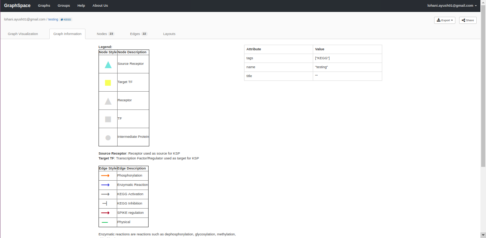
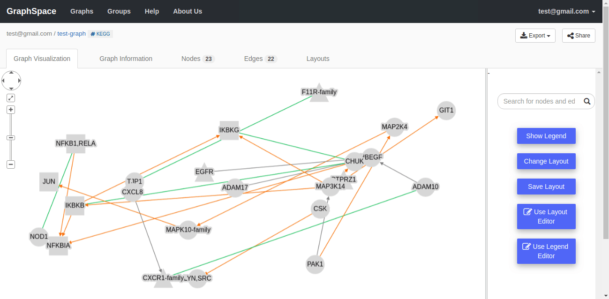
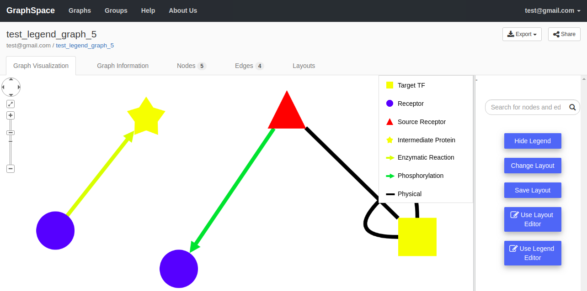
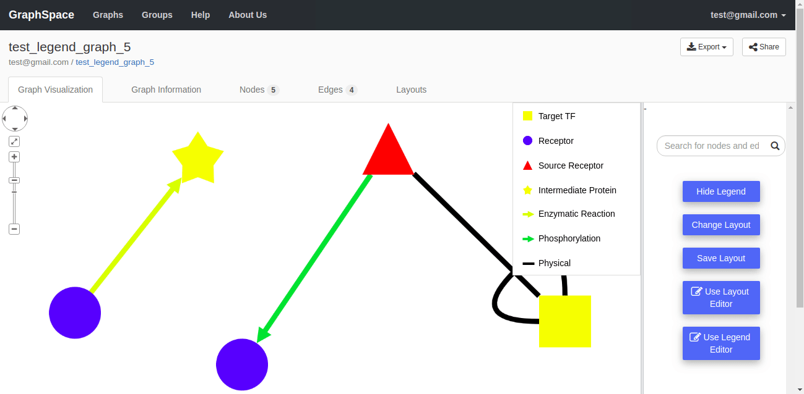
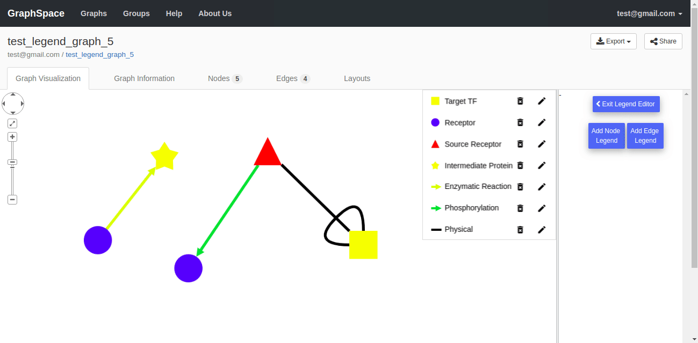
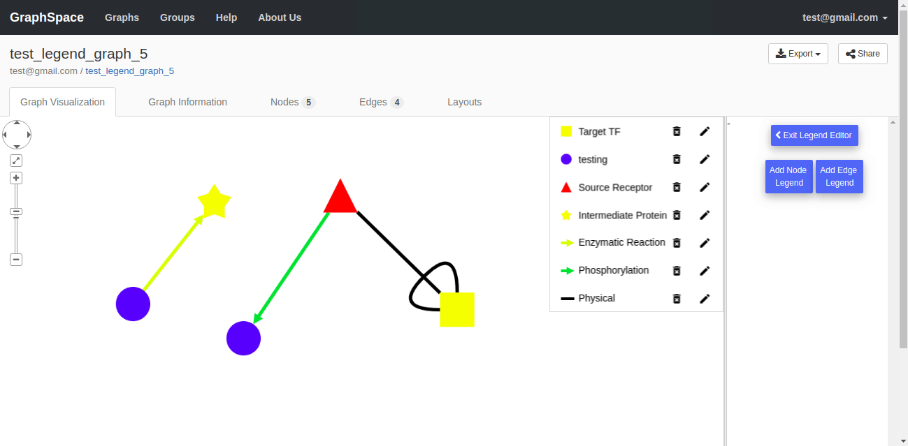
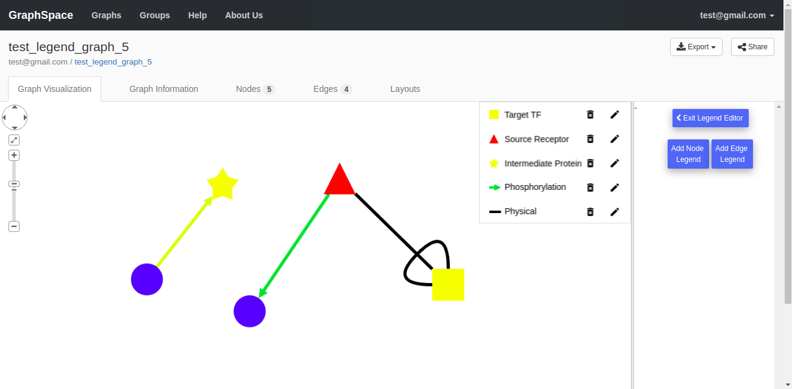
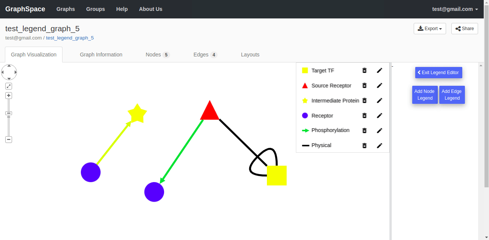
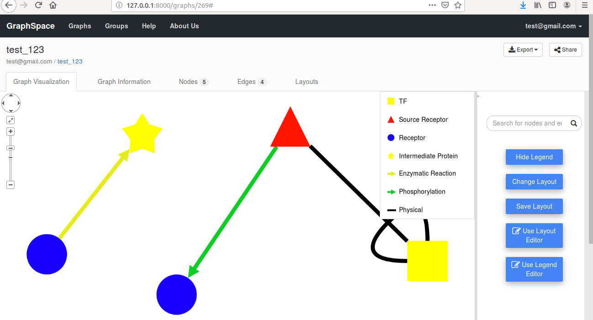
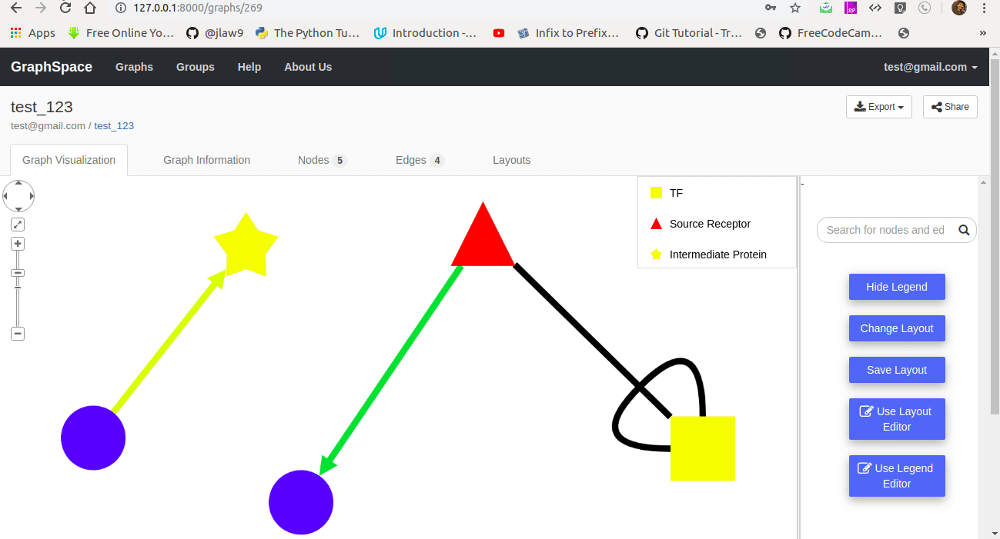

# Graph Legend Interface

Machine-readable graph legend allows users to interact with the legend associated to an individual GraphSpace network in an easier way using GUI and
graphspace_python client library.

##  Legend Support in GraphSpace​ Network Model

Earlier version of GraphSpace had [HTML support for legend](#html-support-for-legend). We have now migrated from HTML format legend support to JSON format legend support.

In the Latest version of GraphSpace, the legend data for an individual GraphSpace Network is stored in [JSON style file](/GraphSpace_Network_Model.html#stylesheet-json-format) in JSON Format as shown below.

```
{
    "format_version": "1.0",
    "generated_by": "graphspace-2.0.0",
    "target_cytoscapejs_version": "~2.7",
    "style": [
        {
            "selector": "node[name='98666']",
            "style": {
                "text-outline-color": "#ffff00",
                "text-opacity": "1",
                "border-color": "#888",
                "label": "",
                "shape": "rectangle",
                "text-halign": "center",
                "text-valign": "center",
                "background-color": "#ffff00"
            }
        }
    ],
    "legend": { //Legend JSON
        "nodes": { 
            "Target TF": {
                "shape": "rectangle",
                "background-color": "#ffff00"
            },
            "Receptor": {
                "shape": "circle",
                "background-color": "#1900ff"
            },
            "Source Receptor": {
                "shape": "triangle",
                "background-color": "#ff1400"
            },
            "Intermediate Protein": {
                "shape": "star",
                "background-color": "#ffff00"
            }
        },
        "edges": {
            "Enzymatic Reaction": {
                "line-style": "solid",
                "arrow-shape": "triangle",
                "line-color": "#e4ee1b"
            },
            "Phosphorylation": {
                "line-style": "solid",
                "arrow-shape": "triangle",
                "line-color": "#0fcf25"
            },
            "Physical": {
                "line-style": "solid",
                "arrow-shape": "none;",
                "line-color": "black"
            }
        }
    }
}
``` 
### Legend JSON
The Legend JSON object contains two types of object:

1.  Node Object: An object of [node legend objects](#node-legend-object) describing the node legend.
2.  Edge Object: An object of [edge legend objects](#edge-legend-object) describing the edge legend.

### Node Legend Object
```
{
    "label": { // Node Legend Style Attributes
            "shape": ...,
            "background-color": ...
        }
}
```

The node legend style attributes accepts the same values as documented in the CytoscapeJS documentation for [list of style properties](http://js.cytoscape.org/#style/node-body) supported by Cytoscape.js.

### Edge Legend Object
```
{
    "label": { // Edge Legend Style Attributes
            "line-style": ...,
            "arrow-shape": ...,
            "line-color": ...
        }
}
```

**arrow-shape** : The shape of the edge’s legend arrow; may be one of:<br>
* triangle
* triangle-tee
* triangle-cross
* triangle-backcurve
* vee
* tee
* square
* circle
* diamond
* chevron
* none

All other edge legend style attributes accepts the same values as documented in the CytoscapeJS documentation for [list of style properties](http://js.cytoscape.org/#style/node-body) supported by Cytoscape.js.

## HTML Support for Legend
In the earlier version of GraphSpace, legend data for an individual GraphSpace Network could be included as an HTML table in the description of the [graph data attributes](/GraphSpace_Network_Model.html#graph-data-attributes) as shown below.

```
{
    "elements":{  // Elements JSON
        "nodes":[ // List of Node Objects
            {  
                "data": { // Node Data Attributes
                    "id": ...
                },
                "position": { // Node Position Attributes
                    "x": ...
                    "y": ...
                }
            }
        ],
        "edges":[ // List of Edge Objects
            {
                "data": { // Edge Data Attributes
                    "source": ..., 
                    "target": ...
                }
            }
        ]
    },
    "data": {   // Graph Data Attributes
        "title": ...,       
        "tags": [..],       
        "description":  "
        <b>Chemical DSS ID</b>: 20784
        <br><b>Legend:</b><table
        border=\"1\"><tr><th>Node Style</th><th>Node Description</th></tr><tr><td
        align=\"center\"><font color=\"#ff3300\" size=\"8\">&#x2666;</font></td><td>Source
        Receptor</td></tr><tr><td align=\"center\"><font color=\"#5d14eb\"
        size=\"8\">&#x2605;</font></td><td>Receptor</td></tr><tr><td align=\"center\"><font
        color=\"#ffff00\" size=\"8\">&#x25a0;</font></td><td>TF</td></tr><tr><td
        align=\"center\"><font color=\"#ffff00\"
        size=\"8\">&#x25cf;</font></td><td>Intermediate
        Protein</td></tr></table><br><br><br><table border=\"1\"><tr><th>Edge
        Style</th><th>Edge Description</th></tr><tr><td>&nbsp;&nbsp;<b><font color=\"#37eb4d\"
        size=\"5\">&#10230;</font></b></td>
        <td>Phosphorylation</td></tr><tr><td>&nbsp;&nbsp;<b><font color=\"#ebbc32\"
        size=\"5\">&#10230;</font></b></td><td>Enzymatic
        Reaction</td></tr><tr><td>&nbsp;&nbsp;&nbsp;<b><font color=\"#000000\"
        size=\"5\">&#x2014;</font></b></td> <td>Physical</td></tr></table><br><br>"​ 
    }
}
```
This Legend data included as an HTML table to a GraphSpace Network was displayed in the [graph information tab](/Viewing_Graphs.html#graph-information-tab) as shown below.



**Note**: GraphSpace will continue to support HTML based legend support but then it will only show up in the [graph information tab](/Viewing_Graphs.html#graph-information-tab) and would remain non-interactive.

## Migrating current GraphSpace Network with HTML Legend Format to JSON Legend Format

There are a lot of existing GraphSpace network which contains legend data in HTML format. GraphSpace provides it's users with the option to automatically convert GraphSpace network containing some particular HTML legend format into corresponding JSON format at one-click of a button.



## Uploading Legend
GraphSpace allows its users to upload a legend for an indivisual network in two different ways:
1. Users may add the Legend data for an individual GraphSpace Network in [JSON style file](/GraphSpace_Network_Model.html#stylesheet-json-format) in JSON Format and upload the network via the web interface at http://graphspace.org/upload.
2. Users may use the `graphspace_python` client library to add, modify and remove legend data for an individual GraphSpace Network.
```
from graphspace_python.api.client import GraphSpace
from graphspace_python.graphs.classes.gsgraph import GSGraph
from graphspace_python.graphs.classes.gslegend import GSLegend

graphspace = GraphSpace('test@gmail.com', '123')

L = GSLegend()
legend_json = {
    "legend":{
        "nodes":{
            "Source Receptor": {
                "shape":"triangle",
                "background-color":"#ff1400"
             },
            "Receptor": {
                "shape":"circle",
                "background-color":"#1900ff"
            }
        },
        "edges":{
            "Phosphorylation":{
                "line-color":"#0fcf25",
                "line-style":"solid",
                "arrow-shape":"triangle"
            }
        }
    }
}
L.set_legend_json(legend_json)

G = GSGraph()
G.set_name('My Sample Graph')
G.set_tags(['sample'])
G.set_legend(L)

graphspace.post_graph(G)

```

## Viewing Legend

The Legend to a graph is shown in the Graph visualization Tab. The Legend Interface is shown on top-right corner of the canvas for a graph. 



The Legend Interface has following features:
* The Hide Legend/Show Legend button available in the side panel on the right side of the graph can be used to toggle between showing and hiding the Legend Interface.



* The Legend Interface can be dragged anywhere on top of the canvas for a graph. 


* The Legend Interface can be used to select nodes or edges of the graph corresponding to a legend just by clicking over that legend in the legend interface.


## Editing Legend

GraphSpace includes a powerful and intuitive legend editor that allow users to add, modify and remove legend for an individual network. The users can activate this functionality by clicking the `Use Legend Editor` button on the page for an individual network.


### Edit a Legend Label
Users can edit a legend label by following the given steps:
1. Click on the the edit icon button present in the legend interface adjacent to the legend that needs to be edited.
2. Add the new label for the node legend.
3. Click on OK to save the changes else click on the Cancel button to discard the changes.



### Remove a Legend
Users can remove a legend by clicking on the the bin icon button present in the legend interface adjacent to the legend that needs to be removed.



### Add Node Legend
Users can add a new node legend by following the given steps:
1. Click on the Add Node Legend button to launch the node editor.
2. Add the visual properties and label for the new node legend.
3. Click on OK to save the changes else click on the Cancel button to discard the changes.



### Add Edge Legend
Users can add a new edge legend by following the given steps:
1. Click on the Add Edge Legend button to launch the node editor.
2. Add the visual properties and label for the new edge legend.
3. Click on OK to save the changes else click on the Cancel button to discard the changes.



### Save Legend
By default GraphSpace provide its user the option to save the legend in the current graph and thus use it as default legend.



However, if the user is working on with user layout then GrapSpace provides the users with 2 options:
1. Use as default legend when no layout is selected
2. Use as legend for the current user layout



